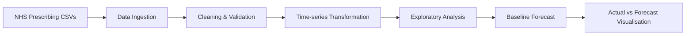

# NHS Pharmacy Demand Forecasting

> A healthcare analytics project using NHS prescribing data to explore regional demand patterns and demonstrate an end-to-end forecasting workflow.

[](https://www.python.org/)
[](https://github.com/Kaviya-Mahendran/nhs_pharmacy_forecast)

## Project objective

Healthcare organisations need reliable demand signals for planning, monitoring and resource allocation.

This project demonstrates a simple workflow for moving from raw NHS prescribing data to cleaned time-series data, exploratory analysis and baseline demand forecasts.

The project is intended for **analytical exploration and portfolio demonstration**, not clinical or operational deployment.

## End-to-end workflow



## What I built

- Data ingestion and cleaning using Python
- Transformation of prescribing data into time-series format
- Data-quality validation checks
- Rolling-average baseline forecasting
- Visual comparison of actual and predicted demand
- Reproducible scripts and notebook-based analysis

## Analytical workflow

### 1. Data preparation

Raw prescribing data is transformed into an analysis-ready time-series structure.

Key considerations include:

- date parsing
- regional grouping
- missing values
- consistent categories
- aggregation at the selected time grain

### 2. Exploratory analysis

The notebook is used to investigate:

- regional demand patterns
- changes over time
- high-volume prescribing areas
- potential seasonality or trend

### 3. Forecasting

A rolling-average baseline is used as a transparent starting point.

This provides a benchmark against which more advanced forecasting methods can later be evaluated.

## Outputs

The project produces:

- cleaned regional time-series datasets
- baseline future-demand estimates
- actual-vs-forecast plots
- notebook-based analytical outputs

## Run locally

```bash
git clone https://github.com/Kaviya-Mahendran/nhs_pharmacy_forecast.git
cd nhs_pharmacy_forecast
pip install -r requirements.txt

python src/transform.py
python src/forecast.py
```

Then open:

```text
notebooks/analysis.ipynb
```

## Analysis artefacts

- [Analysis notebook](./notebooks/analysis.ipynb) — exploratory healthcare demand analysis.
- Generated forecast files and plots are kept alongside the analysis workflow where applicable.

## Model evaluation

This repository intentionally does not publish unsupported performance claims.

For a stronger forecasting study, evaluation should use a chronological holdout and report metrics such as:

- MAE
- RMSE
- MAPE where appropriate
- forecast bias
- performance against a naive baseline

## Limitations

- Forecasting uses a baseline rolling-average approach
- Results depend on the selected aggregation level and data period
- The project is not designed for clinical decision-making
- External drivers and intervention effects are not modelled

## Roadmap

- Drug-level forecasting
- Chronological train/test evaluation
- ARIMA / Prophet comparison
- Advanced forecasting models
- Confidence or prediction intervals
- Interactive Power BI dashboard
- Automated data-quality tests
- Reproducible experiment configuration

**Focus:** healthcare analytics · Python · time-series forecasting · data quality · decision support